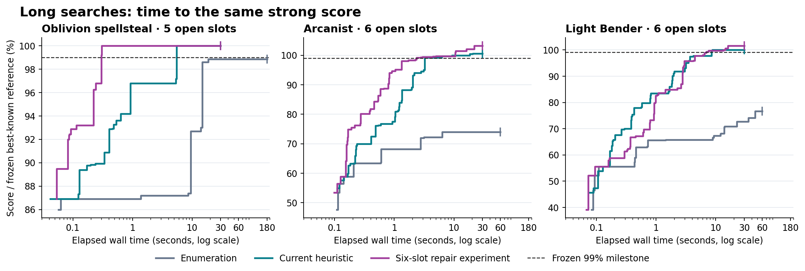

# Long-query solver results

The useful improvement is **finding a strong build quickly on a large search**, not a demonstrated tenfold increase in exhaustive throughput. Bounded neighborhood search repeatedly closes the large Arcanist and Light Bender quality gaps. The two additional experiments—wider exact bounds and elite candidate recombination—do not justify becoming defaults.

This September 8 continuation tests the longer problems requested after the earlier [132-scenario study](ANYTIME_OPTIMIZATION_RESULTS.md). It adds **66 native runs on nine distinct large queries**, plus browser/WASM validation. These are new measurements, not extrapolations from the earlier short tests.

## What becomes practical

The table uses one native thread and the existing production evaluator. “T99” means time to reach 99% of a **previously frozen best-known score for exactly the same fixture**. It is not a guarantee of being within 1% of the true optimum. Enumeration did not reach these targets within its measured caps.

| Longer query | Raw combinations | Enumeration T99 | Core neighborhood search, primary seeds | Core search, fresh seeds | Fresh-seed conservative timing bound |
|---|---:|---:|---:|---:|---:|
| Oblivion spellsteal, five free slots | 2.56 billion | >180 s | 0.92–5.48 s | 0.47–0.61 s | >293× |
| Arcanist Meteor, six free slots | 38.43 trillion | >60 s | 1.35–6.30 s | 1.24–1.58 s | >38× |
| Light Bender healing, six free slots | 6.92 trillion | >60 s | 3.14–8.52 s | 3.00–5.29 s | >11× |

The final column divides the earlier measured no-hit window by the **slower** of the two fresh-seed discoveries. It is a descriptive lower bound from one enumeration run, not a confidence interval or a universal speedup. Primary seeds 707/808 use 30-second budgets; the separately planned, previously unused seeds 1217/2423 use 15 seconds. Across all four core-search seeds, the corresponding worst-case bounds are >32×, >9.5× and >7×. Thus the fresh confirmation meets tenfold on all three cases, but that threshold is not universal across every observed seed.

The score difference matters as much as the timing ratio:

| Query | Enumeration score at 30 s, relative to frozen reference | Core search at 30 s | Practical effect |
|---|---:|---:|---|
| Spellsteal | 98.87% | 100.00%, both seeds | Finds the last roughly 1% of this reference score much sooner |
| Arcanist | 74.05% | 100.62%, both seeds | About 36% higher score than the same-budget enumeration result |
| Light Bender | 72.66% | 100.00–100.06% | About 38% higher score than the same-budget enumeration result |

Spellsteal's very large T99 ratio crosses a threshold only about 0.13 percentage points above enumeration's plateau. It should not be read as an equally dramatic quality gain. Its secondary T95 comparison is also favorable: enumeration takes 14.89 seconds; core search takes 0.34–5.48 seconds across the four seeds. Arcanist and Light Bender are the stronger examples of previously difficult searches producing materially better builds within seconds.

The figure shows the primary native experiment: one enumeration trace and the two-seed median for each heuristic. End markers are measured budget limits, not completion certificates. Elite results are experimental; the fresh-seed findings below are needed to interpret them.

## Large search does not always mean slow discovery

We included three medium families intended to cover minute-scale work and six much broader workloads. The measured search spaces range from 2.56 billion to 2.06 quadrillion raw combinations. The wider cases are candidates for very long exhaustive runs; we deliberately capped them rather than spending hours proving completion.

| Query | Raw combinations | Measured enumeration completion | Time to its frozen T99 |
|---|---:|---:|---:|
| Fate tierstack, five free slots | 2.56 billion | 140.35 s, completed | 0.067 s |
| Oblivion spellsteal, five free slots | 2.56 billion | >180 s | Not reached |
| Divzer hybrid, five free slots | 3.71 billion | >180 s | 0.129 s |
| Trance cancelstack, six free slots | 1.02 trillion | >60 s | 0.068 s |
| Vengeance heavy melee, six free slots | 290 billion | >60 s | 0.083 s |
| Arcanist Meteor, six free slots | 38.43 trillion | >60 s | Not reached |
| Light Bender healing, six free slots | 6.92 trillion | >60 s | Not reached |
| Eight-free-slot spell search | 2.06 quadrillion | >60 s | 0.114 s |
| Gaia, all free | 2.15 trillion | >60 s | 0.057 s |

Six of these nine queries already discover a strong reference score very early. For them, stopping with the retained build removes the wait for exhaustive traversal; it does not represent a new discovery-speed breakthrough. Gaia belongs in this category in the measured fixture. Only the tierstack case was exhausted. The other caps establish lower bounds of 60 or 180 seconds, **not measured one-hour runtimes**.

The new long cohort covers Mage, Assassin, Archer and Shaman. The broader 132-fixture correctness/parity suite covers all five classes; it would be incorrect to describe all 132 as long timed experiments.

## What was implemented and tested

**Bounded neighborhood search is now available in the browser.** Quick search offers 5, 15 and 30-second budgets, streams retained builds, and preserves their item, skill-point and tome witnesses when stopped. It repeatedly changes a subset of slots, exactly evaluates candidates within each bounded repair, retains a diverse archive and changes neighborhoods after stagnation. This crosses multi-item requirement barriers that a one-item hill climb cannot cross. Exhaustive mode remains the default, and Quick reports no global completion percentage or optimality certificate.

**Elite recombination remains opt-in.** The new operator periodically reopens up to six slots, using at most six candidates per slot from the incumbent, archive, ranked candidates and fresh exploration. A repair has at most 46,656 local tuples, while other operators retain access to the original full pools. This is a temporary heuristic restriction, not a proof that excluded global candidates cannot win.

In the primary experiment, elite improved both Arcanist endpoints by about 2.6% over core search and sometimes improved Light Bender. However, the twelve-run fresh-seed check found elite slower to T99 in **five of six matched pairs**, with lower final scores in **two of six**. The earlier large spellsteal elite timing gain did not repeat. Keep `elite_pool=false` by default; the operator and counters remain available for future controlled experiments.

**Wider exact bounds remain off.** On cancelstack, enabling them reduced actual main-search leaf calls by 82.2%, yet processed 40.8% less credited search space within the same 30 seconds. The bounds cost more than the work they avoided. No query obtained a better 30-second score or a new completion. Wider keys may be inactive on already narrow or unsupported objectives, so small differences in those cases are not evidence of a bound improvement.

These experiments do not demonstrate tenfold faster exhaustive solving. They establish a practical fast-result mode and identify optimizations that should not become defaults merely because they prune more leaves or win one seed.

## Benchmark contract and reproducibility

The primary plan contains eight queries and 48 runs. Gaia is a separately frozen six-run supplement. The fresh-seed confirmation adds twelve runs on the three enumeration quality-gap cases, selected before the new heuristic results. All **66 planned runs are present, with no missing/error rows and a retained result in every run**. Targets were frozen before the corresponding runs; the supplemental plans were also published before their runs. Targets remain unchanged when a new score exceeds the old reference.

All native variants retain the top 15 and consume hash-identical raw-pool fixtures with known-unproved prechecks disabled. The long native heuristic profile uses `warm_k=6`, `warm_budget=2000000`, `repair_budget=100000`, `max_repairs=100000` and cyclic stagnation recovery. Both heuristic arms use the same profile; only `elite_pool` differs. **Browser Quick currently uses `max_repairs=10000`**, so native long timings must not be attributed directly to the browser default. Browser-platform results are recorded separately.

Native timing includes launch, parsing and warm search; fixture generation is excluded and recorded separately. Runs were sequential without competing builds. Enumeration contributes common 5/15/30-second checkpoints as well as its longer capped trace. Actual leaf calls, credited tuples, completed scores and main-search bound counts are separate. Repairs overlap, so their domain totals do not measure unique global coverage.

The timed source is local commit `1479d683e0de30d51f14b8ef0a8102bbcc12c34c`, tree `311bc693942ce8d4881b35278e065694851ea836`, published as `d9b1d383c599cf02c7bff9994fa2c1b3eebfc1bb` with the identical tree. Later harness/report additions explain dirty-worktree metadata; the timed Rust source and binaries were frozen. Validation evidence records toolchains, source and binary hashes.

Readable analysis and complete raw evidence are linked from the [evidence index](rust/sp_kernel/evidence/quick_2026_09_08/README.md). The [benchmark guide](rust/sp_kernel/QUALITY_BENCHMARKING.md) describes generation and repeatable comparisons. Future changes should retain these larger cases, frozen score targets, full trajectories, unsuccessful seeds and separate discovery/proof metrics.

## WASM and browser check

A final six-run, 15-second comparison used the **actual browser heuristic profile** (`max_repairs=10000`, elite off) in fresh Node-hosted WASM workers, with seed 1217. Fixture reads and cold worker/module initialization count toward the host deadline; prior fixture generation and browser UI preparation do not.

| Query | Enumeration T99 within 15 s | Quick-profile WASM T99 | Quick endpoint / reference |
|---|---:|---:|---:|
| Spellsteal medium | Not reached | 0.903 s | 100.00% |
| Arcanist, six free slots | Not reached | 1.810 s | 100.62% |
| Light Bender, six free slots | Not reached | 6.576 s | 100.00% |

All six runs retained 15 witnesses before the host stopped them, with zero reported validation errors. This is one-seed platform evidence, **not browser UI timing or a native/WASM throughput comparison**. The independent real-Chromium page test observed a first result at 192 ms and a five-second stop at 5,043 ms on its correctness fixture; those small control timings are not substituted for the long-query results.

## Validation and limits

The continuation passed 35 Rust release tests, 575 JavaScript assertions, 132 native/WASM fixed-work comparisons, three additional elite native/WASM comparisons, and an independent WASM clock/callback check. The full local JavaScript command also reports four browser failures caused by unavailable local browser dependencies and two warnings; it is not described as entirely green. Six of the 132 small-work-budget parity cases return the same empty archive; parity is not proof that those cases are solved. Real Chromium CI passed 60 assertions with zero browser script errors, including deadlines, cancellation, restart isolation, result witnesses and the existing exact path. Browser controls are correctness tests, not the headline long-query timings.

These results optimize the current evaluator. They do not establish full game accuracy, globally optimal remaining-SP allocation, or a certified heuristic gap. Quick rejects unsupported set weapons instead of claiming to model their missing set contribution. Synchronous preparation can block interaction until its deadline, and changing query controls during a run can still affect later result application.

AMPL/CPLEX remains a possible modeling project rather than a measured speed improvement here. A surrogate mixed-integer model could propose candidate builds or solve a repair subproblem, but its gap would certify that model rather than the full combat simulator. The implemented approach reuses the current fast evaluator and now has direct long-query evidence; the [earlier analysis](ANYTIME_OPTIMIZATION_RESULTS.md#where-amplcplex-fits) explains the reformulation tradeoff.
